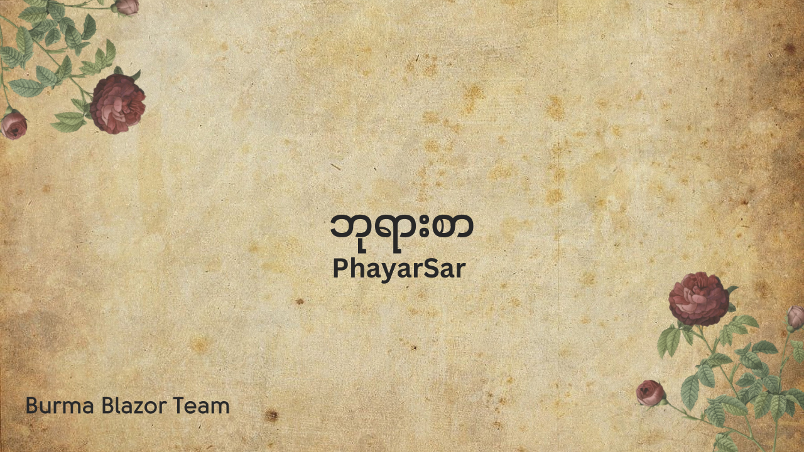

# PhayarSar

PhayarSar Project ရဲ့ ရည်ရွက်ချက်က
 
ကျွန်တော်တို့ ငယ်ငယ်က  ကျောင်းမှာ
 
ဘုရားရှိခိုးတုန်းက ဆိုခဲ့ရတာလေးတွေ
 
သတိရခြင်းနဲ့အတူ
 
[JSON Data](data) တွေ စုလိုက်ပါတယ်

Data တွေကို JSON နဲ့သိမ်းထားပေးပါတယ်
 
Website လည်း လုပ်ထားတယ်
 
ဒီမှာ ၀င်ကြည့်လို့ရပါတယ် 
 
https://blazor-wasm-phayarsar.vercel.app/

Inspect ထောက်ပြီး ကြည့်ရင်လည်း
 
ခေါ်ထားတဲ့ JSON Data တွေရှိတဲ့ 
 
Url ကိုတွေ့ပါလိမ့်မယ်

C# .NET 8 Blazor Web Assembly နဲ့
 
ရေးထားတာမို့ Blazor လေ့လာချင်တဲ့သူတွေအတွက်
 
Public Repository ဖွင့်ထားပေးပါတယ်
 
ဒီမှာ ကြည့်လို့ရပါတယ်
 
https://github.com/sannlynnhtun-coding/BlazorWasm.PhayarSar

Mobile မှာ Swift နဲ့ရေးထားတာလည်းရှိတယ်
 
သူတို့ရေးထားတာက iOS မှာ Download ဆွဲလို့ရပါတယ်
 
https://apps.apple.com/us/app/phayarsar-buddhist-prayers/id6475991817

သူတို့ Project ကိုလည်း အခြားသူတွေ လေ့လာလို့ရအောင်
 
Public Repository လုပ်ထားပေးသေးတယ်
 
https://github.com/kyaw-codes/PhayarSar

